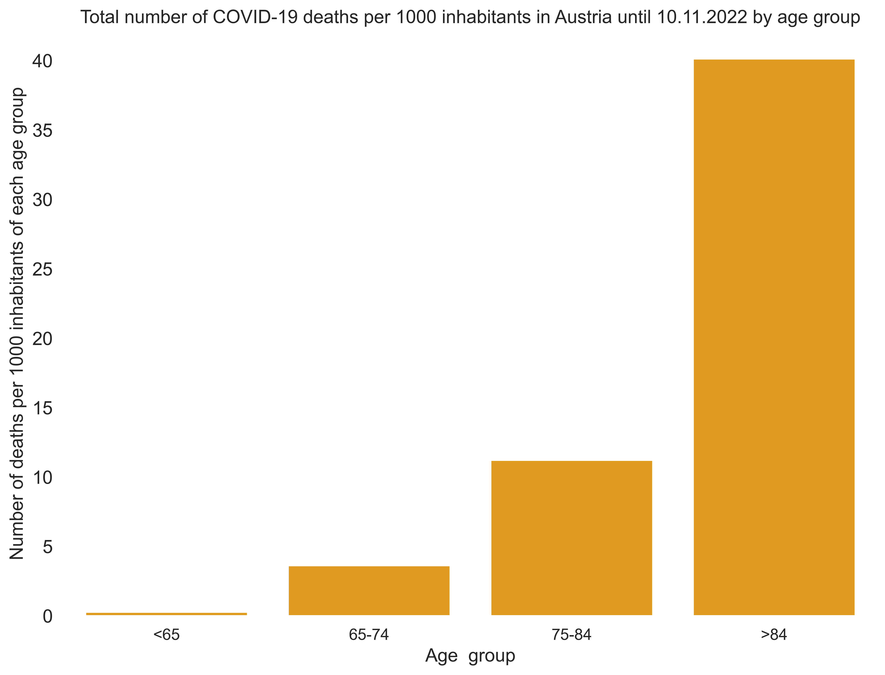

## General Information
# Visual Analytics Lab Project

**Disclaimer:** This is a university group project's final report.
For a detailed project specification, look up the [Visual Analytics Moodel page](https://moodle.jku.at/jku/course/view.php?id=20471).

### Group Members

| Student ID    | First Name  | Last Name      | E-Mail | Workload [%]  |
| --------------|-------------|----------------|--------|---------------|
| k11814156        | Felix      | Breiteneder         |felix.breiteneder@aon.at  |[25%]         |
| K12227403        | Angelika      | Vižintin         |angelika.vizintin@gmail.com  |[25%]         |
| K12107459        | Andeol        | Albitre          |albitrec@protonmail.com  |[25%]         |
| K11944603        | Abel      | Boros          |boros.abel99@gmail.com  |[25%]         |

### Goal of the Project

This project aims to navigate the stages of Data Analysis by sourcing data that aligns with our interests, specifically regarding COVID-19, ensuring it is comprehensive and intricate enough to meet our requirements. We will undertake the essential data cleaning steps and apply visualization best practices and principles outlined in our lectures. We aim to effectively communicate our findings to the audience, either supporting or refuting our initial hypotheses.

Below, you can read our hypotheses, findings, and reports.

## Hypotheses
### Simple Hypotheses
* The number of deaths of COVID-19 patients is the highest in the 85+ group in all of Austria.
* The number of new daily COVID-19 infections in Austria varies between seasons
### Complex Hypotheses
* The number of normal and intensive care hospital beds occupied by patients with COVID-19 and the number of deaths of patients with COVID-19 in Austria decreased over time as the cumulative number of vaccine doses against COVID-19 increased.
* The number of deaths per 100 patients is higher in Vienna compared to Lower Austria among all age groups and all genders.

### Dataset

* What is the dataset about?
* Where did you get this dataset from (i.e., source of the dataset)?
* How big is the dataset?

**Description:**
Our dataset includes numerous statistics about the Covid-19 pandemic in Austria since its beginning. Daily number of infections, hospitalizations, and deaths are available among different age groups. Moreover, all of the data is aggregatable by states and districts. The dataset also includes vaccine, test, and available hospital beds statistics.

The source for our dataset is https://covid19-dashboard.ages.at/. It consists of seven individual datasets, five of which we will use for this project. However, we did also include vaccine statistics from https://www.data.gv.at/katalog/dataset/85d040af-e09a-4401-8d67-8cee3e41fcaa because it was not available via the ages covid dashboard dataset. Finally we included, demographic statistics about Austria from https://www.statistik.at/statistiken/bevoelkerung-und-soziales/bevoelkerung/bevoelkerungsstand/bevoelkerung-zu-jahres-/-quartalsanfang.

The size of our dataset in its raw form consists of six individual datasets. Combined, we do have 542,507 row entries. Moreover, the total number of entries is 4,380,134.

## Simple Hypotheses

### Hypothesis 1 Overview

The aim of Figures 1 and 2 is to investigate the first hypothesis.
The displayed data on both figures were **normalized** by the total number of inhabitants of each age group,
excluding the possibility that the number of deaths in one age group would appear high only because it is the largest group.
Both figures support the hypothesis that the number of deaths is the highest in the 85+ group.

**Figure1**: Total number of COVID-19 deaths per 1000 inhabitants in Austria until 10.11.2022 by age group (source of data: dataset CovidFaelle_Altersgruppe.csv from https://covid19-dashboard.ages.at/).

**Figure2**: Comulative number of COVID-19 deaths per 1000 inhabitants in Austria from 26.2.2020 until 10.11.2022 by age group (source of data: dataset CovidFaelle_Altersgruppe.csv from https://covid19-dashboard.ages.at/).

### Hypothesis 2 Overview

Both visualizations support our hypothesis that daily COVID-19 infections do vary between seasons.
It is visible that there are temporal differences in the number of daily infections.
In the first two years during the pandemic, COVID-19 infections increased significantly in the winter months compared to the warmer seasons.
A new trend can be seen in the current year: COVID-19 infections arise in waves independent of the season.

**Figure1**: Number of daily Covid-19 in Austria (source of data: CovidFaelle_Timeline_edited_2.csv from https://covid19-dashboard.ages.at/).

**Figure2**: Number of Covid-19 infections by season in Austria (source of data: CovidFaelle_Timeline_edited_2.csv from https://covid19-dashboard.ages.at/).

## Complex Hypotheses

We used a logarithmic scaling for our first complex hypothesis to illustrate the decrease over time.

**Figure 1**: Cumulative number of administered COVID-19 vaccine doses, number of daily deaths, and number of occupied regular and intensive care hospital beds until 10.11.2022 (source of data: https://covid19-dashboard.ages.at/).

In Figure 2 and the interactive visualization (presented in the video "hypothesis_2_video.mov"), the
total deaths due to COVID-19 per 100 inhabitants was shown for Lower Austria and Vienna per age group and gender.
The visualizations confirm the hypothesis that the number of deaths is higher in Vienna compared to all age groups and all genders.

**Figure 2**: Total number of deaths per 1000 inhabitants in Lower Austria and Vienna until 10.11.2022 by age group and gender (source of data: https://covid19-dashboard.ages.at/).

We also used **tableau** during the investigation process to create interactive visualization.
You can find the screen recording in the **/submission** folder.

Screenshot from Tableau:

### Black Hat Visualization:

The project also contained an additional task:  
We had to create a so-called **black-hat** visualization where we don't respect the
the general rule of thumb (e.g., not communicating clearly, using unusual scales, etc.) to mislead our audience or put
things into another light.

The plot shows the death count and the number of residents by age group. We used a logarithmic scale, and the axes are inverted so that it appears at first glance that the number of deaths was very high
**For example** for the >84 age group it looks like 3/4 of the people died but also
in the age group of 55-64, one could interpret that half of the people died.

## Summary:

During the project, we repeated the plots several times to follow the guidelines
in the lecture. The goal was to communicate clearly and provide unmistakable plots about our data.
At first glance, they may seem simple, but that is the whole point; complex, fancy plots with too much information are counterproductive
they hide the underlying truth, so when it comes to data visualization, we need to be careful what and how we show to the audience.
While we are entirely familiar with the data and the topic, somebody might need more preparation.